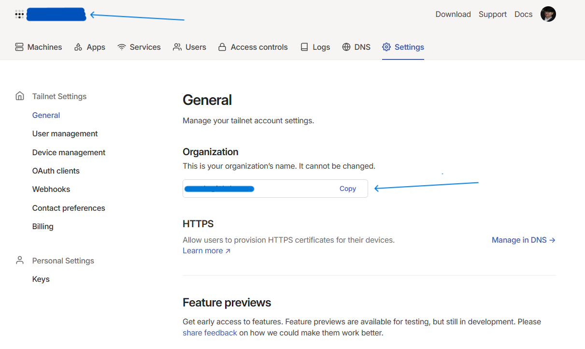

# Tailflare


Sync your **Tail**scale devices to Cloud**flare** DNS.

The functionality is based on this documentation on Tailscale: https://tailscale.com/kb/1054/dns?q=subdomain#using-a-public-dns-subdomain

It is basically taking the Tailscale IP addresses and put them under a subdomain A record on the DNS provider, which is Cloudflare in our case.


## Usage

### Get API keys

- Cloudflare API key: https://developers.cloudflare.com/fundamentals/api/get-started/create-token/
  - Create with permission to modify zones
- Tailscale API key: https://login.tailscale.com/login?next_url=%2Fadmin%%2Fsettings%2Fkeys

### Get Cloudflare zone ID

https://developers.cloudflare.com/fundamentals/setup/find-account-and-zone-ids/

### Get Tailnet organization



### Run directly from source

1. Prerequisites:

- `go` >= v1.21
- `make`

2. Clone this repository

```
git clone https://github.com/aaanh/tailflare
```

3. Go would hopefully install the needed dependencies on first run
4. Run `make run`
